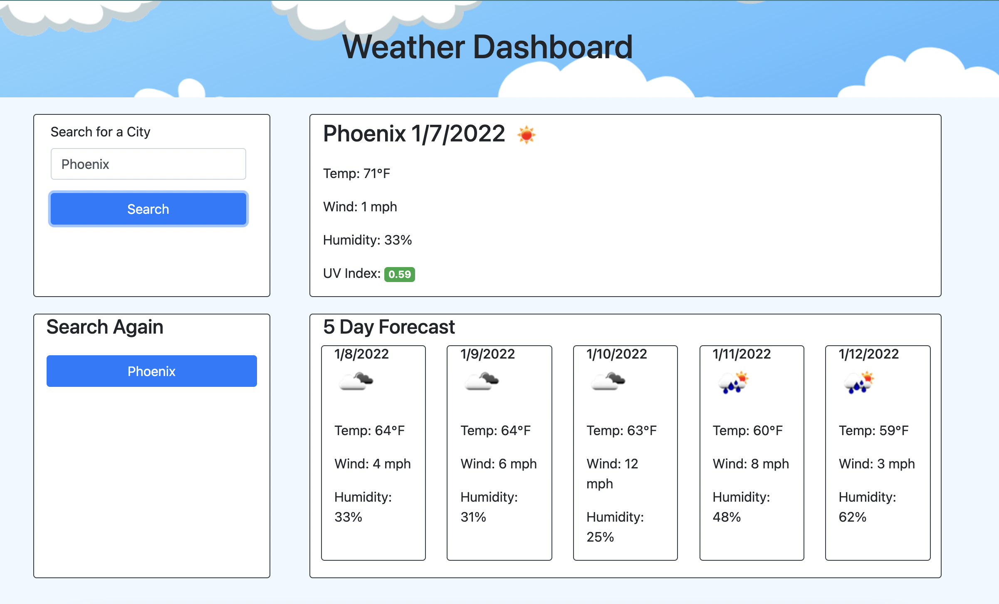

# Weather Dashboard

## Description
As a traveler, I want to see the weather outlook for multiple cities so that I can plan a trip accordingly.
## Acceptance Criteria
GIVEN a weather dashboard with form inputs:
- WHEN I search for a city I am presented with current and future conditions for that city and that city is added to the search history
- WHEN I view current weather conditions for that city I am presented with the city name, the date, an icon representation of weather conditions, the temperature, the humidity, the wind speed, and the UV index
- WHEN I view the UV index I am presented with a color that indicates whether the conditions are favorable, moderate, or severe
- WHEN I view future weather conditions for that city I am presented with a 5-day forecast that displays the date, an icon representation of weather conditions, the temperature, the wind speed, and the humidity
- WHEN I click on a city in the search history I am again presented with current and future conditions for that city
### Layout

### Link
[Weather Dashboard](https://lexslo.github.io/weather-dashboard/)